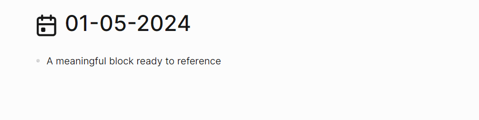

<h1 align="center">"Logseq Block References Context Plugin</h1>

    

The purpose of this plugin is make references readable even when original block was deleted or reading markdown file outside from logseq.

## Usage

Write slash command `/Block Reference Context` into a block with at least one block reference.

## TODOs
- [ ] Add shortcut command
- [ ] Option for automatic mode when pasting
- [ ] Try to keep original block css (now it only keeps text)